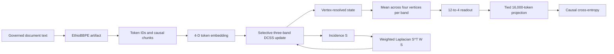

# CDI Architecture: Implementation Review for CCT Level 1

> **Scope.** This document describes the implementation present on `master` at review revision `ae607ed9aa3c09f26c358e6c3187d4fbc83db700`. It separates the **active CCT language-engine path** from legacy and experimental modules so that a reader can identify the code that produced the recorded CCT evidence. It does not make a fluency, scale, speed, long-context, or production-readiness claim.

## Executive Architecture Map

The repository contains two materially different systems. The active CCT language engine is the `cdi.v3` path, exercised by `benchmarks/ethiobbpe_synaxarium_pilot.py`. It uses EthioBBPE tokens, a compact selective recurrent state-space cell, a sparse graph-Laplacian correction, a tied vocabulary projection, and matched GRU/Transformer baselines. The older `cdi.engine` path is a separate dense v2 mathematical prototype with different data, tokenizer-wrapper, state, and execution assumptions. It is **not** the source of the CCT-G1 or CCT-G2.1 results. [1] [2] [3]

| Layer | Active CCT implementation | Principal responsibility |
|---|---|---|
| Token contract | `cdi/v3/tokenizer.py` | Loads EthioBBPE, snapshots `tokenizer.json`, fingerprints the artifact, and rejects out-of-range IDs. |
| Language model | `cdi/v3/language_model.py` | Maps token IDs to four-dimensional embeddings, executes the recurrent cell, masks padding, ties the output projection to embeddings, and computes causal next-token loss. |
| Recurrent core | `cdi/v3/ssm.py` | Maintains three vertex-resolved memory bands; applies bounded selective gates, stable pairwise rotation/dissipation, and graph-Laplacian correction. |
| Topological substrate | `cdi/v3/topology.py`, `incidence.py`, `laplacian.py` | Builds a deterministic oriented simplicial fan and applies the weighted Laplacian without a dense global state matrix. |
| Training contract | `cdi/v3/training.py` | Packs document-local chunks, seeds reproducibly, trains with finite-gradient checks, and snapshots checkpoint metadata. |
| Empirical contract | `benchmarks/ethiobbpe_synaxarium_pilot.py` | Creates deduplicated document splits and trains CDI, GRU, and Transformer under the same declared token budget. |
| Verified restore path | `cdi/v3/production/inference.py` | Restores a saved tokenizer artifact and checkpoint only after strict sidecar, lineage, vocabulary, shape, topology, and model-fingerprint checks. |

The diagram shows the actual computational order. The topology acts on the vertex-resolved state **after** a band update and **before** the readout. The readout currently consumes only the mean of each band over vertices. This placement is mathematically important and is analyzed below. [2] [4]

## End-to-End Execution Path

The active pilot begins by downloading the configured Synaxarium dataset, constructing stable document identifiers, deduplicating exact text by SHA-256 content hash, and producing a 70/15/15 document split. `DataManifest` rejects duplicate identifiers, duplicate content, and cross-split reuse. The harness then freezes an EthioBBPE tokenizer artifact, packs document-local chunks, and gives every model the same chunk length, batch size, seed list, optimizer family, causal-token budget, and evaluation batches. [3] [5]

| Execution step | Concrete implementation behavior | Boundary of the claim |
|---|---|---|
| Corpus admission | Exact-content deduplication and document-level split isolation occur before tokenization. | Near-duplicate or semantic overlap is not detected. |
| Tokenization | The adapter requires contiguous vocabulary IDs and special tokens; checkpoints contain the tokenizer JSON snapshot and artifact fingerprint. | It uses the published tokenizer artifact rather than training a tokenizer on the pilot corpus. |
| Chunking | Each document is split independently into fixed chunks; no chunk crosses a document boundary. | The recurrent state resets for each chunk, so the active pilot does not measure dependencies longer than the configured chunk length. |
| Training | AdamW training performs causal loss, finite-loss checks, finite/nonmissing gradient checks, clipping, and deterministic batch order when enabled. | The declared `warmup_steps` and `gradient_accumulation` settings are not used by the active loop. |
| Evaluation | The CCT pilot harness aggregates loss by active causal token count and can evaluate every held-out batch. | The generic helper in `training.py` averages batch loss rather than token-weighting it; the pilot does not use that helper. |
| Evidence | `latest.json` stores configuration, manifest, tokenizer fingerprint, seed-level records, result fingerprint, revision, and environment summary. | A final CCT decision must still apply the stricter Todo gate, not merely the harness verdict. |

## Token and Causal-Loss Contract

`EthioBBPETokenizer` is a major correction over the historical mismatch. It wraps the published EthioBBPE backend, emits `<s> text </s>` token sequences by default, rejects IDs outside `[0, vocab_size)`, and serializes the exact tokenizer JSON alongside special-token IDs and a fingerprint. The language model allocates `nn.Embedding(vocab_size, 4, padding_idx=pad_id)`, zeroes the pad embedding at initialization, and projects logits through the same embedding matrix. Thus the vocabulary used to form input IDs is the vocabulary used for embeddings and output logits. [1] [4]

For a token sequence \(x_0,\ldots,x_{T-1}\), the active loss sends the prefix \(x_0,\ldots,x_{T-2}\) through the model and compares the logit at time \(t\) with \(x_{t+1}\). A loss mask requires both the source and target positions to be active, preventing padded positions from contributing. This is correct next-token alignment for the active CCT model and both baseline adapters. [4]

## The Active DCSS State Space

The nano CCT configuration uses four vertices and three memory bands named `fast`, `middle`, and `harmonic`. Each band is a tensor \(z_b \in \mathbb{R}^{V\times w}\), where \(V=4\) and \(w=4\). The total persistent state is therefore

\[
3 \times 4 \times 4 = 48
\]

scalar state elements. The bands have disjoint nominal time-constant ranges: fast \([0.25,1]\), middle \([2,8]\), and harmonic \([16,64]\). The code validates even channel width, separated bands, positive time constants, CPU/float32 or float64 reference execution, and a sub-64 state-size constraint for the nano tier. [2]

For each token embedding \(e_t\in\mathbb{R}^4\), each band produces a bounded selective gate. A `tanh` forcing projection is multiplied by a sigmoid input gate. A bounded `tanh` offset modifies a learned log-time constant, which is then clamped to the band interval. Pairwise transport gates determine a skew-rotation frequency, while a sigmoid scalar controls the geometric correction. The important bounded quantities are

\[
\tau_{b,t}=\exp\!\left(\operatorname{clip}(\log\tau_b+\Delta_t)\right),
\qquad
\lambda_{b,t}=\frac{0.05+\sigma(g_t)}{\tau_{b,t}}>0,
\]

with one \(\lambda\) and one angular frequency \(\omega\) for each pair of channels. Positive dissipation is structurally enforced in ordinary execution. [2]

### Pairwise Stable Integrator

Each pair of channels evolves under the two-dimensional generator

\[
A= -\lambda I+
\begin{bmatrix}
0 & -\omega\\
\omega & 0
\end{bmatrix}.
\]

The implementation applies the exact decay-and-rotation action for this block rather than constructing a dense global state matrix. For a step size \(\Delta t\), the homogeneous update is a rotation by \(\omega\Delta t\) scaled by \(e^{-\lambda\Delta t}\), followed by explicit bounded input forcing:

\[
\widetilde z_{b,t+1}=e^{A\Delta t}z_{b,t}+\Delta t\,u_{b,t}.
\]

This is a strong design choice for the present nano model: it supplies a direct dissipative stability envelope, preserves energy under the diagnostic zero-dissipation rotation, and avoids a per-token dense \(48\times48\) state matrix. The class is named `CayleyIntegrator`, but its implemented formula is an exact pairwise block exponential rather than a Cayley solve. [2]

## Sparse Topology and Geometry

`SparseTopology` constructs an oriented fan triangulation with canonical vertices, undirected edge storage, and faces \((0,i,i+1)\). It validates connectivity and the exact discrete boundary identity \(\partial_1\partial_2=0\). `SparseIncidence` implements the vertex-to-edge difference by gather and its transpose by scatter-add. The learnable geometric operator is

\[
L=S^{\top}WS,
\qquad W=\operatorname{diag}(\operatorname{softplus}(\theta_e)+10^{-6}),
\]

which is symmetric positive semidefinite. It is applied channelwise without materializing the full state operator. The correction in each active band is

\[
z_{b,t+1}=\widetilde z_{b,t+1}-\alpha_{b,t}L\widetilde z_{b,t+1},
\qquad
\alpha_{b,t}=0.02\,\sigma(g^{\mathrm{geom}}_{b,t}).
\]

The topology, incidence, PSD quadratic form, dense test oracle, and boundary-of-boundary diagnostics are all real code paths, not labels only. [5] [6] [7]

## Readout and the Central Architectural Limitation

After the correction, the cell forms one four-dimensional mean vector per band,

\[
m_{b,t}=\frac{1}{V}\sum_{v=1}^{V}z_{b,t}[v,:],
\]

concatenates the three vectors into a 12-dimensional feature, and applies a 12-to-4 linear readout. The tied output layer maps those four values to the vocabulary. [2] [4]

This readout creates a decisive invariant. Because \(L=S^{\top}WS\) is a graph Laplacian, \(\mathbf{1}^{\top}L=0\). The geometry correction therefore has zero vertex mean:

\[
\frac{1}{V}\mathbf{1}^{\top}(\widetilde z-\alpha L\widetilde z)
=
\frac{1}{V}\mathbf{1}^{\top}\widetilde z.
\]

The recurrent generator and selective gates are shared across vertices and depend on the token embedding rather than on vertex-specific state. By induction, the vertex-mean trajectory used by the readout is invariant to the Laplacian correction, while the correction only changes vertex contrast that the readout discards. This is confirmed by a direct language-model probe on identical full and geometry-disabled models: maximum logit difference `2.95585778076e-12`, causal-loss difference `0`, and geometry-weight causal-loss gradient L2 norm `0`. The full and geometry-disabled states do differ, so the problem is **state-to-readout observability**, not a missing Laplacian computation. [2] [4]

> **Engineering conclusion:** the current model has a genuine sparse geometric state transformation, but that transformation does not currently affect the token-loss path in a meaningful numerical sense. The geometry-free ablation cannot establish geometry value until the readout or recurrence is revised under CCT-G3.1.

## Baselines and Parameter Matching

The CCT pilot uses two baselines sharing the tokenizer, causal loss, padding behavior, optimizer family, chunk length, batch size, seed list, and batch schedule. The GRU baseline uses a width-four `GRUCell`; the Transformer baseline uses one causal encoder layer with width four, one head, feedforward width eight, and no dropout. All three models use tied output projection and a vocabulary bias. The resulting total parameter counts are approximately 80,120–80,366, with the 16,000-way embedding/output matrix dominating the count. [3] [4]

This is a useful compact fairness design, but it also means that the recurrent core has very little parameter budget and only a four-dimensional vector reaches the vocabulary head. The 48-state CDI structure is internally richer than the final token feature, yet the current 12-to-4 compression discards vertex-resolved information and limits the mechanism that can distinguish CDI from a small GRU. [2] [4]

## Stability and Reproducibility Strengths

The active implementation has several strong foundations that should be preserved.

| Strength | Implementation evidence | Why it matters |
|---|---|---|
| Token identity integrity | Artifact snapshot, fingerprint, strict contiguous-ID and range checks. | Prevents the historical data-tokenizer/model-tokenizer corruption failure. |
| Causal state handling | Step and chunk APIs are tested for equivalence; padding freezes recurrent state. | Ensures the evaluated model is causal and batch padding does not advance state. |
| Bounded dynamics | Positive dissipation, bounded gates, finite timescale intervals, exact pairwise update. | Gives a meaningful local numerical stability contract. |
| Sparse operator construction | Incidence gather/scatter and weighted Laplacian avoid a dense global state operator. | Prevents accidental dense lifting in the active recurrence. |
| Governed pilot | Content-hash deduplication, document split isolation, matched seed/model protocol, full held-out option. | Makes the G1/G2.1 comparison interpretable. |
| Fail-closed inference | Production inference validates sidecar, tokenizer, vocabulary, topology, lineage, and model fingerprint. | Rejects incompatible checkpoints rather than silently decoding with guessed artifacts. |

## Boundaries of the Current Evidence

CCT-G1 established that the repaired active language path can reduce loss on a bounded real-data task. CCT-G2.1 showed stable learning on the full deduplicated pilot corpus and remained within the declared Transformer tolerance, but CDI was above GRU validation loss in all three seeds. The governing decision is therefore `REDESIGN_BEFORE_SCALE`; the 3,000-step rung is not authorized. [8] [9]

The implementation does **not** yet support a claim that CDI is faster than a Transformer. Its token loop is executed in Python, topology tensors are recreated lazily on property access, and CCT-G2.1 measured lower throughput than both baselines. It also does not yet support a long-context claim because training packs fixed, independent chunks and resets state for each chunk. [3] [9]

## Legacy and Experimental Modules

The repository also retains the earlier v2 dense engine (`cdi.engine`, `cdi.core`, `cdi.geometry`, `cdi.operators`, `cdi.dynamics`, `cdi.topology`, and `cdi.field`) and later optional capability modules. They are valuable historical and mathematical reference material, but they are not the active CCT language-model path. The v2 engine uses a dense flat belief state, Euler heat updates, manual tensor parameter ownership, and legacy data scripts. Its `small` preset implies a 393,216-element flat state before dense operator construction, which is not a demonstrated feasible dense CPU configuration. The optional capability modules are bounded retrieval/planning/verification utilities and explicitly do not generate language-model answers or modify core weights. [10] [11]

The top-level `cdi` import exposes the legacy v2 API, while CCT uses `cdi.v3`. This separation should be made explicit in user-facing documentation and entry points to avoid executing the wrong system. [12] [13]

## References

[1]: [EthioBBPE tokenizer adapter](cdi/v3/tokenizer.py)  
[2]: [Selective cohomodynamic state-space implementation](cdi/v3/ssm.py)  
[3]: [Matched EthioBBPE Synaxarium pilot harness](benchmarks/ethiobbpe_synaxarium_pilot.py)  
[4]: [DCSS language model and baselines](cdi/v3/language_model.py)  
[5]: [Deterministic sparse topology](cdi/v3/topology.py)  
[6]: [Matrix-free Laplacian](cdi/v3/laplacian.py)  
[7]: [Sparse incidence operator](cdi/v3/incidence.py)  
[8]: [CCT-G2.1 decision record](docs/CCT_G2_1_DECISION.md)  
[9]: [CCT evidence index](docs/CCT_EVIDENCE_INDEX.md)  
[10]: [Legacy CDI v2 engine](cdi/engine.py)  
[11]: [Bounded optional capability orchestrator](cdi/v3/capabilities/orchestrator.py)  
[12]: [Top-level legacy package exports](cdi/__init__.py)  
[13]: [v3 package exports](cdi/v3/__init__.py)
