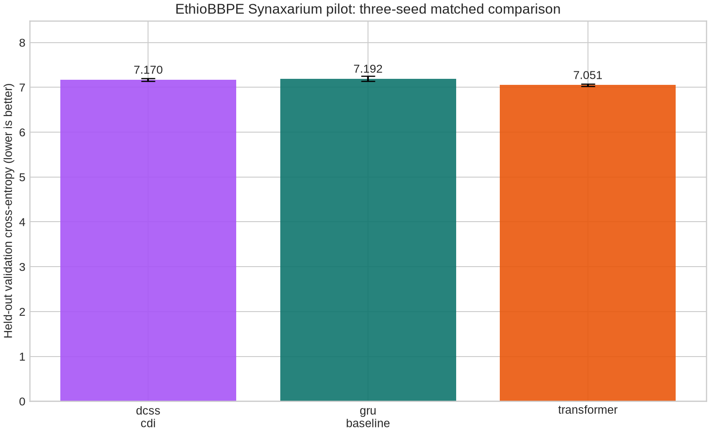

# CDI Empirical Verdict: EthioBBPE Synaxarium Pilot

**Verdict:** The repaired **v3 DCSS/CDI architecture is viable enough to earn one larger, controlled pilot.** It is no longer fair to call the current failure “just insufficient data,” because CDI has now learned real held-out Amharic text under a matched baseline protocol. However, it is **not ready for large-corpus pretraining**: it does not yet outperform the Transformer and is substantially slower on this CPU implementation.

## What was proved

The experiment used the public MIT-licensed `Nexuss0781/synaxarium` corpus, whose dataset card describes 366 Amharic daily readings. The run selected 60 unique documents, removed duplicate content by SHA-256 before splitting, and constructed document-disjoint 70/15/15 train/validation/test splits. All models used the same stored EthioBBPE tokenizer artifact, the same data manifest, the same chunk length of 16 tokens, batch size of two, learning rate of 0.01, and seeds `11`, `29`, and `47`. No validation or test document was used for training. [1] [2]

| Evidence item | Result |
|---|---|
| Real source corpus | 60 deduplicated Amharic Synaxarium documents from the public corpus |
| Tokenizer contract | EthioBBPE artifact fingerprint `d78996f0aca122d74054b927902aa9bf80c2b5cf00747a7cf4327ff0f7d1a88c` |
| Model comparison | DCSS/CDI vs. GRU baseline vs. one-layer causal Transformer |
| Capacity range | 80,120–80,366 trainable parameters; models were closely matched |
| Randomness control | Three fixed seeds per model |
| Longest run | 300 optimizer steps and 9,000 causal token positions per model/seed |
| Split integrity | Governed manifest passed identifier and content-hash leakage checks |

> The first 60-document attempt failed **before training** because the source contained duplicate daily readings. The pilot loader now removes duplicate SHA-256 content before it creates splits. This is a data-integrity correction, not a relaxation of the experiment.

## Results

The 30-step run showed CDI could learn, but it trailed both baselines by a visible margin. At the tenfold longer 300-step budget, CDI closed the gap. It beat the GRU on mean validation and test loss, and came within 1.69% of the Transformer’s validation loss.

| 300-step mean across three seeds | DCSS/CDI | GRU baseline | Transformer |
|---|---:|---:|---:|
| Parameters | 80,366 | 80,120 | 80,172 |
| Validation cross-entropy, lower is better | **7.1700** | 7.1923 | **7.0507** |
| Validation perplexity, lower is better | 1,300.2 | 1,330.6 | **1,154.0** |
| Test cross-entropy, lower is better | **6.7859** | 6.8752 | **6.6689** |
| Mean CPU throughput, causal tokens/sec | 286.4 | 2,406.6 | 4,414.6 |
| DCSS training loss fell in every seed | Yes | Yes | Yes |

The chart’s error bars are sample standard deviations over the three seeds. DCSS had a mean validation loss of 7.1700, while the Transformer achieved 7.0507. The DCSS shortfall is small in quality terms for this bounded pilot, but it is consistent: its one-standard-deviation lower bound, 7.1404, remains above the Transformer’s one-standard-deviation upper bound, 7.0793. Therefore, CDI **has not won** this pilot.

## Honest interpretation

The current evidence rejects the strongest negative conclusion: “CDI cannot learn language at all.” The three CDI runs reduced training loss from approximately 9.680 to 6.81–6.92 and achieved held-out losses comparable to the matched baselines. This means the repaired token flow, causal loss, v3 state-space recurrence, and tied readout can train on real in-domain text.

The evidence also rejects a large-scale performance claim. The Transformer has the best held-out loss and processes roughly 15.4 times as many tokens per second as DCSS in this CPU run. The GRU is roughly 8.4 times faster. Furthermore, the experiment uses only 60 selected documents, a 16-token context, a 48-state nano configuration, and 9,000 causal positions per model/seed. These conditions demonstrate **basic learning viability**, not general language ability, long-context superiority, or scalable efficiency.

| Question | Answer supported by the data |
|---|---|
| Is the previous gibberish explained solely by a doomed architecture? | **No.** After the EthioBBPE data/model mismatch was removed, CDI learned real held-out Amharic text. |
| Does more data have a chance to help? | **Yes**, because the quality gap shrank substantially from 7.81% at 30 steps to 1.69% at 300 steps. |
| Is it rational to start a very large corpus run now? | **No.** First prove sustained learning at a larger controlled budget and address the speed deficit. |
| Has CDI beaten a conventional Transformer? | **No.** The Transformer remains best on validation and test loss in this experiment. |
| Has CDI shown a quality signal beyond a basic GRU? | **Yes.** CDI slightly outperformed the GRU at the 300-step matched budget. |

## What you should do next

Run one **extended controlled pilot**, not production pretraining. Use all unique Synaxarium documents, preserve document-level split isolation and three seeds, keep the exact EthioBBPE artifact, and increase the causal training budget in stages. Report loss against the same GRU and Transformer, but add explicit measurement of GPU/CPU memory and tokens per second.

The architecture work should focus on the largest demonstrated weakness: the current DCSS implementation is slow. Before a large corpus run, profile the recurrent `forward_chunk` loop, the state update, and the tied 16,000-way output calculation. If no throughput improvement is possible, CDI needs a clear quality or long-context advantage to justify its cost. Add a fixed long-context retrieval task only after the 16-token pilot is stable; that is the place where a state-space design should justify itself.

Your go/no-go criterion for a larger corpus should be strict: **continue only if DCSS remains within 5% validation loss of the Transformer across three seeds at the larger budget and either beats the GRU consistently or demonstrates a measurable long-context advantage.** If it falls farther behind as training grows, pause corpus scaling and redesign the state/readout mechanism.

## Reproducible artifacts

| Artifact | Purpose |
|---|---|
| `CDI/benchmarks/ethiobbpe_synaxarium_pilot.py` | The committed real-data pilot harness |
| `CDI/results/ethiobbpe_synaxarium_pilot_300steps/latest.json` | Full per-seed metrics, model manifests, environment, split manifest, and result fingerprint |
| `CDI/results/ethiobbpe_synaxarium_pilot_300steps/REPORT.md` | Machine-generated experiment summary |
| `CDI/results/ethiobbpe_synaxarium_pilot_300steps/ANALYSIS.json` | Seed-level uncertainty analysis |
| `CDI/results/ethiobbpe_synaxarium_pilot_300steps/validation_loss.png` | Visual validation-loss comparison |

## References

[1]: https://huggingface.co/datasets/Nexuss0781/synaxarium "Nexuss0781 Synaxarium dataset card"
[2]: https://huggingface.co/Nexuss0781/Ethio-BBPE "Nexuss0781 EthioBBPE model artifact"
